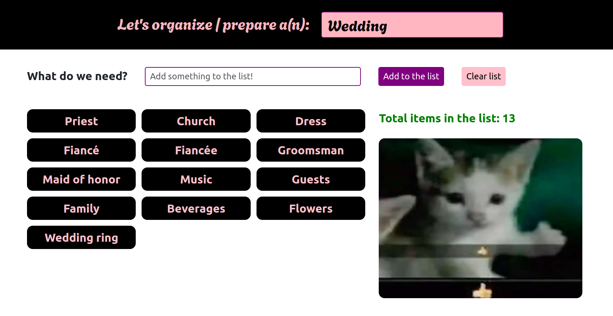
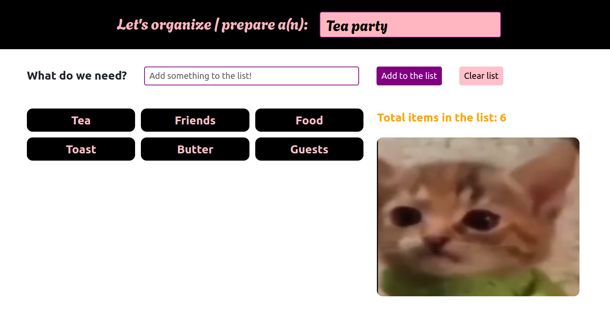
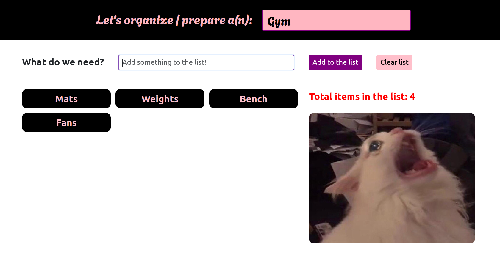

# Let's prepare

Little game to be played for warm-up/closing, you or the students can choose something to prepare, like a wedding, birthday party or barbecue, and then you have to list what is needed to make it happen, for instance, a wedding needs a fiancé, fiancée, guests and more.

> Project link: <https://brenomorim.github.io/letsprepare/>

---

## Screenshots

The cat image changes according to the number of items in the list:

### Good - above 12



### Neutral - between 6 and 12



### Bad - below 6



---

## Running locally

The app uses React and is run by default on port 3000.

```sh
git clone https://github.com/BrenoMorim/letsprepare.git letsprepare
cd ./letsprepare

npm i
npm start
```

---

## Running on Github Pages

```sh
npm run predeploy
npm run deploy
```
